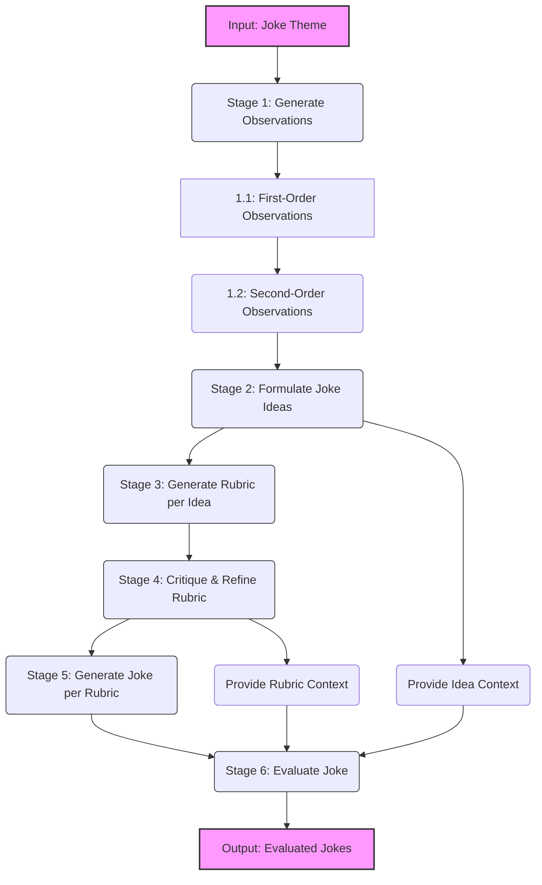

# PlanSearch Inspired Joke Generation 

## Pipeline Overview 
I had to think quite a bit on how plansearch could be adapted for a task with no verifiable objective metric of correctness per se i.e. for code generation there is usually a binary rubric, whether it implements a feature successfully or not, or whether it passes all the testcases of the test suite or not. However, for jokes there is obviously no such metric. 

The pipeline I used has the following parts:

- **Step 1:** Primary Observations for a given context/word on which jokes are to be generated. (Ideas)
- **Step 2:** Secondary Observations for a given context/word on which jokes are to be generated.
- **Step 3:** Generation of Joke Rubrics for each specific joke idea obtained via primary and secondary observations.
- **Step 4:** Critique of the given rubric and its subsequent improvement.
- **Step 5:** Generation of jokes given:
  - Type: {joke_type}
  - Structure: {joke_structure}
  - Key Elements to Include: {key_elements}
  - Tone: {tone}
- **Step 6:** Save EVERYTHING into a nice well formatted json for evaluation purposes.



## Setup and Execution Instructions 

The repository has the following structure:
```
.
├── baseline_1.json
├── baseline_joke_gen.py
├── baseline.json
├── gen_ideas.py
├── gen_jokes.py
├── gen_rubrics.py
├── joke_judge.py
├── joke_judgments.json
├── main.py
├── README.md
├── results.json
└── uv.lock
```

### Installation and Usage
```bash
# Install all the dependencies
pip install -r requirements.txt

# Run the main pipeline (change the default config unless you want only penguin jokes xD)
python main.py

# Generate baseline jokes without all these framework shenanigans to see if this even works
python baseline_joke_gen.py "penguins" --save-raw --enhanced -n 12 -o baseline.json

# Run the evaluation suite (needs json files containing both baseline and plansearch jokes)
python joke_judge.py --multistage results.json --baseline baseline_1.json \
    --api-endpoint "https://openrouter.ai/api/v1"
```
Please note that there is just a single requirement of openai in terms of dependencies. 

## Models Used for Generation and Judgement

Since I had to experiment a lot with generation choosing the free tier of any of the available providers was not feasible hence I went over to creative bench and then chose the smallest possible model which did decently on their creative benchmark, which surprisingly happened to be **Gemma 3-4B** which had strong ranking w.r.t its size. I chose the `Q4` quantized variant of the model which was released recently officially via google with claims of comparable performance with its `FP16` variant. Good for us GPU-Poor peeps ig? This model fit in nicely on my laptop with an RTX 4060 (8GB-VRAM) and ran at a respectable 60-70 tok/s with 16k context.

For judgement, I utilised the **Deepseek-V3-0324:free** model from openrouter. I forgot to read more on its rate limits and hence exhausted my daily limits in experimentation before I could run it for the last time to finalise my judgment results. However, I did obtain some initial judgment results which are kinda interesting.

## Results Obtained 


| Metric | Multi-Stage | Baseline | Difference |
|--------|-------------|----------|------------|
| **Overall Score** | 7.46/10 (median: 7.8, stdev: 0.93) | 6.60/10 (median: 6.4, stdev: 1.13) | **+0.86** |
| **Humor Level** | 6.19/10 (median: 6.0, stdev: 1.38) | 6.00/10 (median: 6.0, stdev: 0.95) | **+0.19** |
| **Originality** | 7.81/10 (median: 8.5, stdev: 1.60) | 6.08/10 (median: 5.5, stdev: 1.51) | **+1.73** |
| **Coherence** | 8.19/10 (median: 8.0, stdev: 0.98) | 7.58/10 (median: 8.0, stdev: 1.62) | **+0.61** |
| **Cleverness** | 7.38/10 (median: 8.0, stdev: 1.02) | 6.50/10 (median: 7.0, stdev: 1.45) | **+0.88** |
| **Appropriateness** | 8.62/10 (median: 9.0, stdev: 1.31) | 8.67/10 (median: 9.0, stdev: 1.83) | **-0.05** |

Here, I compare the baseline jokes as well as the jokes generated from the plansearch-inspired pipeline; they are both judged independently of each other. For the plansearch-inspired joke, I provide the rubric, tone and other available originating details to the LLM judge and ask it to rate it on a scale of 10 on parameters of Humour Level, Originality, Coherence , Cleverness and Appropriateness. These scores were also obtained for baseline jokes in a similiar manner.

A sample of 12 baseline and plansearch jokes were used for this comparison.
## Jokes Showcase xD

The funniest joke which the LLM found regarding `penguins` seems to have been this one:

> "My dating profile picture is just me sliding on ice. Surprisingly, it hasn't attracted much attention. Apparently, 'glacial charm' isn't a winning strategy."

I think this one is OK? I dont see how this stands out from some of the other jokes which I found to be genuinely hilarious.

Here is the associated ideas and concepts which led to our funniest joke xD:

```json
{
  "id": "f047f14d-a89c-4f72-a88c-db9a7190be67",
  "theme": "Penguins",
  "idea_id": "44b0a98e-6c5e-42b8-8e88-83656760f122",
  "rubric_id": "ee256564-6e4d-4563-beb1-b251ef14aa27",
  "text": "My dating profile picture is just me sliding on ice. Surprisingly, it hasn't attracted much attention. Apparently, 'glacial charm' isn't a winning strategy.",
  "explanation": "This joke adheres to the rubric by following a setup-punchline structure. The setup introduces a penguin attempting online dating and highlights his unusual profile picture (sliding on ice). The punchline reveals the ironic outcome – lack of romantic success due to the inherent limitations of his lifestyle. It incorporates the key elements ('Penguin attempting online dating', 'Profile picture: Sliding on ice', 'Lack of romantic success/rejection (implied)', 'A brief, understated observation about penguin life') and maintains a dryly absurd and slightly melancholic tone, reflecting the penguin's inherent challenges in finding love.",
  "metadata": {
    "joke_type": "Setup-Punchline",
    "tone": "Dryly absurd and slightly melancholic",
    "structure": "The setup establishes the penguin's unusual situation and desire. The punchline delivers the ironic or absurd consequence of that situation."
  }
}
```

Have a look at this another masterpiece xD:

> "Barry the penguin downloaded 'FlapDate,' determined to find his soulmate. He meticulously crafted a profile: 'Likes fish, waddling, and surprisingly good at synchronized swimming.' Then came the photo – him sliding on ice at 80 mph with his flippers wildly flapping. Montage cut to Barry awkwardly sending emojis in texts ('🐟❤️'), attempting to hold hands (resulting in a tangled mess of feathers), and generally failing miserably at any romantic interaction. Suddenly, *whoosh!* - Barry launches off the screen in another epic slide, ending up plastered on a billboard advertising 'Arctic Ice Cream.' Turns out, he's just really, really good at sliding."

Other jokes related to penguins can be enjoyed in results.json :) 
## Mandatory Questionnaire Answers 

### Why did you pick the particular project?

Honestly, because the entire idea seems hilarious, I honestly can't think why I never thought of experimenting along these lines xD. Apart from the fun factor, I was also intrigued whether, at all, the creative diversity of LLM-generated slop could be improved with some framework.

### What did you learn in the project?

I think I learnt quite a lot of things:

- It's a lot more harder to implement ideas from research papers as it seems even if a reference code repository is available.
- Even though I know about rate limits, while running my judge code, it was a hard reminder for me to add fallbacks in code interacting with LLMs, especially when using free tier APIs to respect rate limits :(
- Inferencing on a local device (especially a Laptop) is tricky even if the model technically fits in the VRAM buffer. There whole hosts of things that can influence inference from background processes to just heat dissipation.
- LLM-as-a-Judge is a very sketchy metric in literature; its use has been justified by stating that they are not much better or worse than their human counterparts. Which I personally find hard to digest.


### If you had more compute/time, what would you have done?

Do multiple runs for both generation and evaluation, and also could have used a stronger model like Claude Sonnet for evaluation or generation. I could also explore a multi-agentic LLM as a judge setup with multiple models critiquing various parameters of the joke and then deciding on the overall quality of the joke.

### What surprised you the most?

The quality of small LLMs in the present day, I didnt expect gemma-3 4b deliver stellar or creative jokes, but its results exceeded my expectations in terms of creativity and diversity. Also was surprised by how well it ran on my 4060. Also the LLMs also quite expectedly failed in multi lingual joke generation , I tried with a random theme in Hindi which somehow led to degraded responses to the point where the generated jokes didnt even make any semantic sense or logical sense.

### If you had to write a paper on the project, what else needs to be done?

If I were to write a research paper on this the statistical significance of the LLM as a judge results need to certained by generating and evaluating a larger sample of baseline jokes and the same from the plansearch procedure to ascertain if the entire pipeline leads to any noticeable improvement or not. Preliminary results point to a positive outcome tho.

## Thoughts on the followups 

Novelty is a tricky concept, for instance if one would do a simple google search, its difficult to find exact word by word match for most of these jokes however on searching for the specific rubrics, punchlines or ideas would probably shed some more light how 'novel' these jokes really are. In literature novelty on LLM generations has mostly been explored in the context of research ideas however there are a few research papers exploring novelty in domain of literary creativity as well, one such research paper uses LLMs to generate novel recipes and defines novelty in the following manner:

> "Novelty can be assessed by identifying how uncommon an idea is within a dataset (Heinen and Johnson, 2018; Kenett, 2019; Doboli et al., 2020). Evaluating value, however, is highly domain-dependent, often considered the "holy grail" of computational creativity (Boden, 2004; Ritchie, 2007; Jordanous, 2012)." [1]

Hence I feel perhaps a mix of keyword search and semantic search for specific punchlines and ideas which led to jokes can be a decent starting point towards measuring novelty of these jokes.

## References

1. Mizrahi, M., Shani, C., Stanovsky, G., Jurafsky, D., & Shahaf, D. (2025). Cooking Up Creativity: A Cognitively-Inspired Approach for Enhancing LLM Creativity through Structured Representations. *arXiv preprint arXiv:2504.20643*.

## Credits 

- https://gwern.net/creative-benchmark 
- https://www.greaterwrong.com/posts/xMGmibZpPDnawjHXk/generating-the-funniest-joke-with-rl-according-to-gpt-4-1
- https://arxiv.org/abs/2306.05685
- https://github.com/scaleapi/plansearch
- https://arxiv.org/abs/2409.03733
